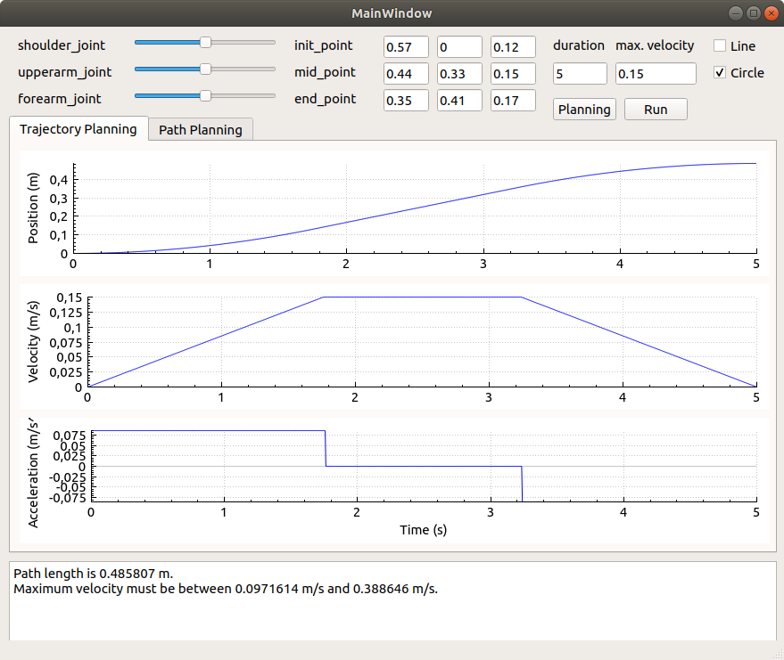
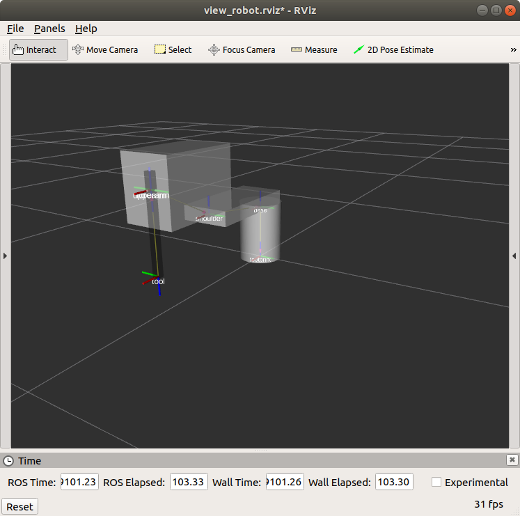

# SCARA_Motion_Planning
Motion Planning for SCARA Robot Arm, implemented in C++, visualized with Qt-GUI and Rviz.

## Summary
This work is my final project in the course Robotics, taught by Dr. Giap Nguyen-Hoang.

  

  

## Build and Run
Just clone this workspace, catkin-make and run the start_model.launch file.
